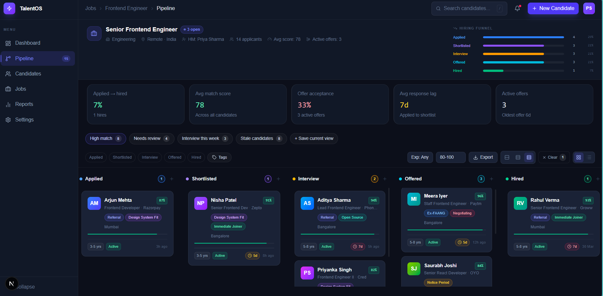
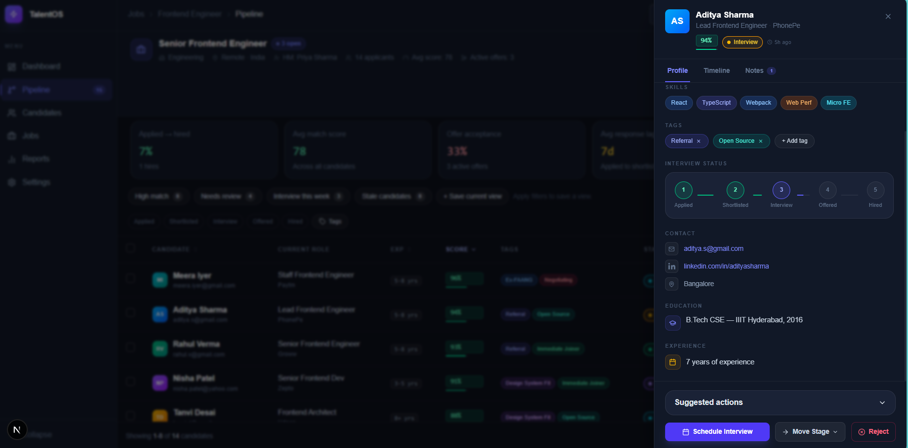
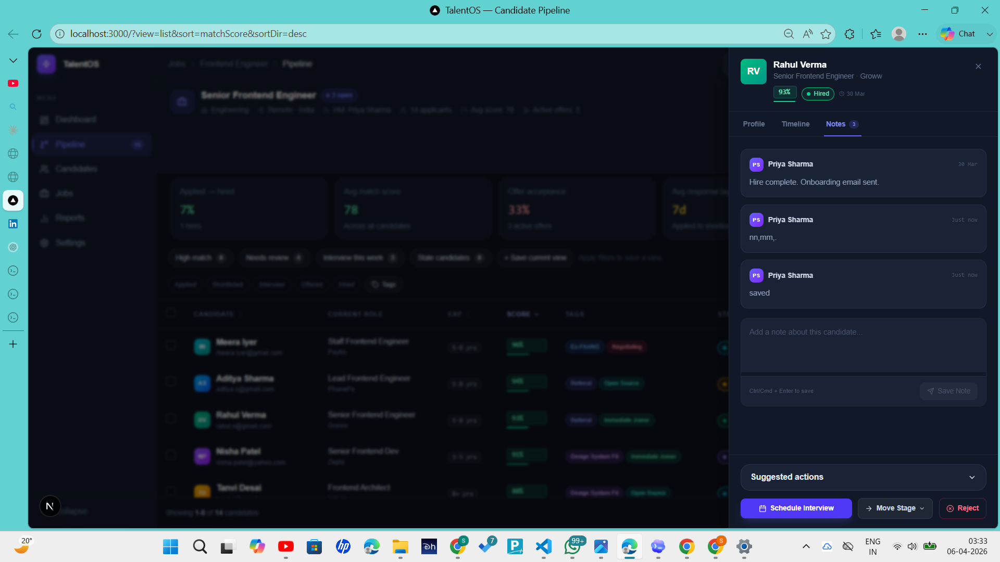

# TalentFlow Candidate Pipeline Dashboard

TalentFlow is a responsive recruitment SaaS dashboard built with Next.js, React, TypeScript, and Tailwind CSS. It is designed to feel like a polished hiring operations product, with strong visual hierarchy, recruiter-friendly workflows, and production-style empty, loading, and interaction states.



## Screenshots

### Dashboard overview


### Candidate pipeline



### Candidate detail experience



## Features

- Responsive dashboard shell with sidebar, top navigation, breadcrumbs, and mobile drawer navigation
- Job overview with live funnel metrics, average match score, and active offers
- Candidate pipeline in both Kanban and table views
- Global search plus stage, experience, score, tag, and stale-candidate filters
- Candidate drawer with profile details, interview status, notes, timeline, tags, and suggested actions
- Bulk actions, stage movement, CSV export, and interview scheduling
- Proper loading, empty, no-results, and per-stage empty states
- Accessibility improvements including skip link, focus management, live regions, and keyboard-friendly controls

## Tech Stack

- Next.js
- React
- TypeScript
- Tailwind CSS
- Zustand
- Lucide React

## Getting Started

1. Install dependencies:

```bash
npm install
```

2. Start the development server:

```bash
npm run dev
```

3. Open [http://localhost:3000](http://localhost:3000) in your browser.

## Scripts

```bash
npm run dev
npm run build
npm run lint
```

## Core Workflows

### Candidate management

- Review candidates by stage in a board layout
- Switch to table view for denser scanning and sorting
- Open the candidate drawer for deeper context and actions
- Move candidates individually or in bulk
- Reject candidates with status and timeline updates
- Schedule interviews directly from the dashboard

### Recruiter productivity

- Saved views for repeated hiring workflows
- SLA and aging indicators to spot stuck candidates
- Insights strip for funnel conversion and response speed
- Tagging system for sourcing and prioritization signals

### Export and persistence

- Export selected candidates from bulk actions
- Export filtered candidates from the filter bar
- Preserve filters and view state in the URL
- Persist UI preferences such as sidebar state, density, and view mode locally

## Mobile Support

- Slide-in sidebar drawer
- Mobile search tray
- Responsive board and table layouts
- Mobile scrolling fixed for full dashboard access

## Project Structure

```text
src/
  app/
  components/
  hooks/
  lib/
  store/
  types/
```

## Data Notes

- Candidate and job data are mocked locally for the assignment
- Store-driven derived metrics keep counts in sync as candidates move through stages
- CSV export is generated client-side in the browser

## Build

Create a production build with:

```bash
npm run build
```
